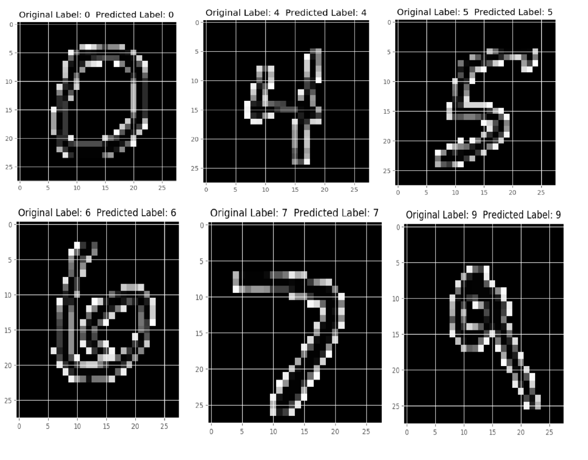

# Handwritten Digit Recognition using Machine Learning and Deep Learning

A machine learning project that recognizes handwritten digits (0–9) using the MNIST dataset. Four different algorithms are implemented and compared — K Nearest Neighbors, Support Vector Machine, Random Forest, and a Convolutional Neural Network.

---

## What is this project?

Handwritten digit recognition is the ability of a computer to identify handwritten digits from images. This project trains and evaluates four different ML/DL models on the MNIST dataset — a collection of 70,000 grayscale images of handwritten digits (28×28 pixels each).

Each model is trained on 60,000 images and tested on 10,000 images. The results are compared to find which algorithm performs best.

---

## Project Structure

```
Project_3/
├── 1. K Nearest Neighbors/
│   ├── knn.py
│   ├── summary.log
│   └── MNIST_Dataset_Loader/dataset/
├── 2. SVM/
│   ├── svm.py
│   ├── summary.log
│   └── MNIST_Dataset_Loader/dataset/
├── 3. Random Forest Classifier/
│   ├── RFC.py
│   ├── summary.log
│   └── MNIST_Dataset_Loader/dataset/
├── CNN_Keras/
│   ├── CNN_MNIST.py
│   └── cnn/neural_network.py
├── Outputs/
├── Results/
├── download_dataset.py
├── requirements.txt
└── README.md
```

---

## Algorithms Used

### 1. K Nearest Neighbors (KNN)
Classifies a digit by finding the K closest training images and taking a majority vote. Simple but effective for image data.

### 2. Support Vector Machine (SVM)
Finds the best boundary that separates each digit class from others. Uses a polynomial kernel to handle non-linear patterns.

### 3. Random Forest Classifier (RFC)
Builds 100 decision trees and combines their results. Each tree votes for a digit and the majority wins.

### 4. Convolutional Neural Network (CNN)
A 3-layer deep learning model that learns spatial features like edges and curves directly from pixel data. Most powerful of the four.

---

## Results

| Algorithm | Validation Accuracy | Test Accuracy |
|-----------|-------------------|---------------|
| K Nearest Neighbors | 97.35% | 96.81% |
| Support Vector Machine | 97.85% | 97.64% |
| Random Forest Classifier | 97.20% | 96.89% |
| **CNN (Deep Learning)** | — | **99.31%** |

CNN outperforms all traditional ML algorithms because it learns visual patterns directly from images instead of treating pixels as independent features.

---

## Tech Stack

- **Language:** Python 3.13
- **ML Library:** Scikit-Learn
- **Deep Learning:** TensorFlow, Keras
- **Image Processing:** OpenCV
- **Data Handling:** NumPy, Pandas
- **Visualization:** Matplotlib

---

## Setup and Installation

### Step 1 — Clone the repository
```bash
git clone https://github.com/yourusername/Handwritten-Digit-Recognition.git
cd Handwritten-Digit-Recognition
```

### Step 2 — Install dependencies
```bash
pip install -r requirements.txt
```

### Step 3 — Download MNIST Dataset
Run the provided script to automatically download and place the dataset in all required folders:

```bash
python download_dataset.py
```

This downloads all 4 MNIST binary files into KNN, SVM and RFC folders automatically. CNN downloads its own dataset when you run it.

---

## How to Run

### KNN
```bash
cd "1. K Nearest Neighbors"
python knn.py
```
> Results are saved in `summary.log` inside the KNN folder.

### SVM
```bash
cd "2. SVM"
python svm.py
```
> Results are saved in `summary.log` inside the SVM folder.

### Random Forest
```bash
cd "3. Random Forest Classifier"
python RFC.py
```
> Results are saved in `summary.log` inside the Random Forest folder.

### CNN
```bash
cd CNN_Keras
python CNN_MNIST.py
```
> CNN downloads the MNIST dataset automatically on first run. Training takes 15–30 minutes.

### Save CNN weights after training
```bash
python CNN_MNIST.py --save_model 1 --save_weights cnn_weights.hdf5
```

### Load saved CNN weights (skip retraining)
```bash
python CNN_MNIST.py --load_model 1 --save_weights cnn_weights.hdf5
```

---

## Sample Output



---

## How it Works — Flow

```
  MNIST Dataset (70,000 images)
        ↓
  Preprocessing (normalize pixel values 0–1)
        ↓
  60,000 Training Images → 90/10 Split
        ↓
  54,000 Train Images | 6,000 Validation Images
        ↓
  Train Model (KNN / SVM / RFC / CNN)
        ↓
  Evaluate on Validation Set (6,000 images)
        ↓
  Final Test on Separate MNIST Test Set (10,000 images)
        ↓
  Accuracy + Confusion Matrix + Sample Predictions
```

---

## Key Learnings

- CNN achieves the highest accuracy (~99.31%) because it learns spatial patterns like edges and curves from images
- SVM performs best among traditional ML algorithms at 97.64%
- KNN is the simplest algorithm but still achieves ~96.81% accuracy
- KNN and RFC include 5-Fold Cross Validation for more reliable accuracy estimation
- Pixel normalization (dividing by 255) consistently improves accuracy across all algorithms
- The confusion matrix shows digit 8 is hardest to classify across all algorithms

---

## References

- [MNIST Dataset — Yann LeCun](http://yann.lecun.com/exdb/mnist/)
- [Published Paper — IJARCET](http://ijarcet.org/wp-content/uploads/IJARCET-VOL-6-ISSUE-7-990-997.pdf)